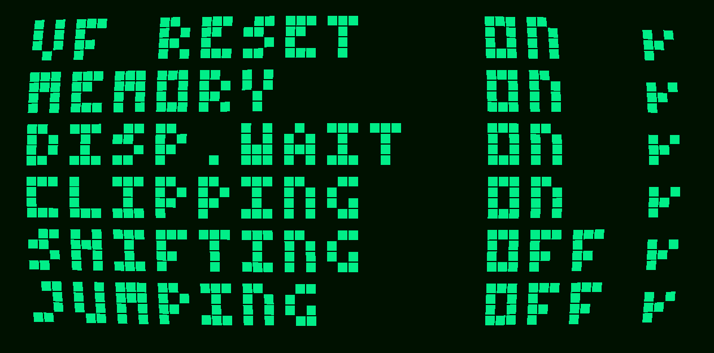

# README #

### How do I get set up? ###

* compile with VS2022
* precompiled binary in ./bin (SDL2.dll in same directoy required)

### Who do I talk to? ###

* Repo owner

### Links ###

* http://devernay.free.fr/hacks/chip8/C8TECH10.HTM#8xy6
* http://johnearnest.github.io/Octo/docs/chip8ref.pdf
* https://github.com/Timendus/chip8-test-suite#chip-8-splash-screen
* https://github.com/loktar00/chip8/blob/master/roms/Tetris%20%5BFran%20Dachille%2C%201991%5D.ch8

### Screenshots ###

